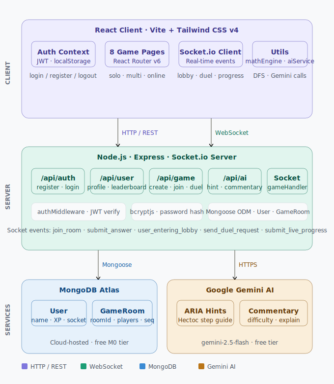

# 🧮 Maths Wizard — Competitive Real-Time Math Gaming Platform

<div align="center">


**A full-stack competitive math gaming platform featuring AI-powered gameplay, real-time online duels, and 8 distinct game modes — built from a legacy HTML/Firebase stack and fully migrated to a production-grade MERN architecture.**

[🎮 Play Now](#-getting-started) · [📖 Architecture](#-architecture) · [⚡ Features](#-game-modes) · [🔄 Migration Story](#-tech-stack-migration)

</div>

---

## 📌 Problem Statement

Mental math is a critical but underrated cognitive skill. Existing math learning platforms fall into two categories — either dry drill-based tools with no engagement, or casual games with no real mathematical depth.

**Maths Wizard solves this by combining:**
- Serious mathematical challenge (Hectoc puzzle — make 100 from 6 digits using operators)
- Competitive real-time gameplay (online duels, matchmaking, local split-screen)
- AI-assisted learning (ARIA — a Gemini-powered companion that gives adaptive hints and live commentary)
- Progressive difficulty that adapts to player skill level

The goal was to build something that makes math feel like a competitive sport — with leaderboards, sound effects, animations, and real opponents.

---

## 🔄 Tech Stack Migration

This project began as a client-side-only web app and was **fully migrated to a production MERN stack** — a deliberate architectural decision documented commit-by-commit in the Git history.

### Original Stack (v1)
```
Frontend   →  Vanilla HTML + CSS + JavaScript
Auth       →  Firebase Authentication
Database   →  Google Firestore (NoSQL, client-side)
Realtime   →  Firestore onSnapshot() listeners
Hosting    →  Firebase Hosting
Backend    →  None (everything client-side)
```

### Why Migration Was Needed

| Problem | Impact |
|---|---|
| No backend — all logic ran in the browser | Security risk, no server-side validation |
| Firebase Auth — no control over token lifecycle | Couldn't customize auth flows |
| Firestore onSnapshot — tied to Google's SDK | Hard to extend, expensive at scale |
| Vanilla JS — no component reusability | Code duplication across 15+ HTML files |
| No API layer | Couldn't integrate external services like AI APIs |

### New Stack (v2 — Current)
```
Frontend   →  React 18 (Vite) + Tailwind CSS v4
Auth       →  JWT (jsonwebtoken) + bcrypt
Database   →  MongoDB Atlas + Mongoose
Realtime   →  Socket.io WebSockets
Backend    →  Node.js + Express
AI Layer   →  Google Gemini 2.5 Flash API
```

### Migration Mapping

| Old | New | Why |
|---|---|---|
| `login.html` + Firebase Auth | `Login.jsx` + JWT + bcrypt | Full auth control, stateless tokens |
| `signup.html` + Firebase | `Signup.jsx` + MongoDB User model | Custom schema, password hashing |
| `index.html` + Firestore | `Home.jsx` + REST API | Server-side leaderboard queries |
| Firestore `onSnapshot()` | Socket.io `io.to(room).emit()` | Lower latency, no vendor lock-in |
| 15 separate HTML files | React Router + component tree | Shared state, reusable components |
| No backend | Node.js + Express server | API layer, AI integration, security |

---

## 🏗️ Architecture


```
┌─────────────────────────────────────────────────────┐
│                    CLIENT (React/Vite)               │
│                                                      │
│  ┌──────────┐  ┌──────────┐  ┌───────────────────┐  │
│  │  Auth    │  │  Game    │  │   Socket.io       │  │
│  │ Context  │  │  Pages   │  │   Client          │  │
│  │ (JWT)    │  │  (8 modes│  │   (real-time)     │  │
│  └──────────┘  └──────────┘  └───────────────────┘  │
│       │              │                │              │
│  ┌──────────┐  ┌──────────┐  ┌───────────────────┐  │
│  │mathEngine│  │aiService │  │   Tailwind CSS    │  │
│  │ (DFS)    │  │  .js     │  │   + Web Audio API │  │
│  └──────────┘  └──────────┘  └───────────────────┘  │
└────────────────────────┬────────────────────────────┘
                         │ HTTP + WebSocket
┌────────────────────────▼────────────────────────────┐
│                NODE.JS + EXPRESS SERVER              │
│                                                      │
│  ┌──────────┐  ┌──────────┐  ┌───────────────────┐  │
│  │  /auth   │  │  /user   │  │     /ai           │  │
│  │ register │  │ profile  │  │  hint / commentary│  │
│  │  login   │  │leaderboard│ │  difficulty/explain│  │
│  └──────────┘  └──────────┘  └───────────────────┘  │
│  ┌──────────┐  ┌──────────┐  ┌───────────────────┐  │
│  │  /game   │  │ Socket.io│  │  authMiddleware   │  │
│  │  create  │  │ Handler  │  │  (JWT verify)     │  │
│  │  join    │  │          │  │                   │  │
│  └──────────┘  └──────────┘  └───────────────────┘  │
│                     │                │               │
│          ┌──────────▼────┐  ┌────────▼────────────┐  │
│          │  MongoDB Atlas │  │   Gemini AI API     │  │
│          │  (Mongoose)   │  │  gemini-2.5-flash   │  │
│          └───────────────┘  └─────────────────────┘  │
└─────────────────────────────────────────────────────┘
```

### Database Schema

**User Model**
```js
{
  name: String,
  email: String (unique),
  passwordHash: String,       // bcrypt hashed
  score: Number,              // global XP leaderboard
  gamesPlayed: Number,
  isOnline: Boolean,          // lobby presence tracking
  lobbyStatus: 'idle' | 'searching' | 'playing',
  socketId: String            // active WebSocket session ID
}
```

**GameRoom Model**
```js
{
  roomId: String,             // 6-char unique code
  players: [{ userId, name, score }],
  status: 'waiting' | 'playing' | 'finished',
  sequence: String,           // 6-digit Hectoc sequence
  round: Number,
  maxRounds: Number
}
```

---

## ⚡ Game Modes

### 🤖 VS ARIA (AI Opponent)

| Mode | Description |
|---|---|
| **Hectoc Challenge** | Given a 6-digit sequence, use +, −, ×, ÷ between digits in order to make exactly 100. ARIA provides adaptive hints via Gemini AI. |
| **Lightning Math** | Answer arithmetic questions before the computer does. 5 seconds per question. First to 10 wins. ARIA delivers live commentary after every answer. Questions get harder every 2 rounds. |
| **Sliding Puzzle** | Arrange numbered tiles to their correct order. Choose 3×3 (Easy), 4×4 (Medium), or 5×5 (Hard). |

### 👥 Local Split-Screen Multiplayer

| Mode | Description |
|---|---|
| **Hectoc Battle** | Two players, one device. Same sequence shown to both. First to solve correctly wins the round. First to 3 wins the match. |
| **Calculator Battle** | Both players get different questions simultaneously. Answer your own independently. First to 10 correct wins. |
| **Sliding Race** | Each player gets a different randomized board. Race to solve your own puzzle first. |

### 🌍 Online Duel

| Feature | Description |
|---|---|
| **Random Matchmaking** | Join a queue and get paired with another online player instantly. |
| **Direct Challenge** | See who's in the lobby and send a direct duel invitation to any available player. |
| **Live Keystroke Streaming** | As you type your expression, your progress is streamed in real-time to your opponent's screen. |
| **Composite Scoring** | Final score is calculated from speed + hints used: `score = 500 - (hintsUsed × 30) - (timeTaken × 2)` |

---

## 🧠 Core Algorithm — DFS Expression Engine

The Hectoc puzzle engine is built on a **recursive Depth-First Search** algorithm that:

1. Takes a 6-digit sequence (e.g. `5 4 2 6 9 9`)
2. Recursively inserts one of `[+, −, ×, ÷]` between each digit
3. Evaluates the resulting expression using `new Function()`
4. Returns the first valid expression that equals exactly 100
5. Guarantees every generated sequence has at least one valid solution before the player sees it

```js
function dfs(digits, index, current) {
  if (index === digits.length) {
    return evaluate(current) === 100 ? current : null;
  }
  for (const op of OPERATORS) {
    const result = dfs(digits, index + 1, current + op + digits[index]);
    if (result !== null) return result;
  }
  return null;
}
```

The algorithm evaluates up to **4⁵ = 1,024 operator combinations** per sequence. Sequences that have no valid solution are discarded and regenerated automatically.

---

## 🤖 ARIA — AI Companion (Gemini Integration)

ARIA (Artificial Reasoning Intelligence for Academics) is powered by **Google Gemini 2.5 Flash** and serves four roles:

### 1. Smart Hint Engine (Hectoc)
- Receives the player's current partial expression
- Runs the DFS diagnostic locally first to detect exact mistake position
- Sends the diagnostic + player input to Gemini
- Gemini translates technical output into natural, encouraging wizard-themed language
- Never reveals the full solution — only guides one step at a time

### 2. Live Commentary (Lightning Math)
- After every question, sends: question, player answer, correct answer, response time, scores
- Gemini generates a competitive 1-sentence response in ARIA's personality
- Commentary changes based on game state: winning, losing, fast answer, wrong answer

### 3. Adaptive Difficulty
- Every few rounds, sends player's accuracy rate and average response time to Gemini
- Gemini recommends a difficulty level (1–10)
- Question generator adjusts number ranges and operator complexity accordingly

### 4. Mistake Explanation
- When player answers wrong in Lightning Math
- Gemini explains in one sentence exactly why the answer was wrong
- Focuses on order of operations and arithmetic reasoning

### API Endpoints

```
POST /api/ai/hint        → adaptive Hectoc hint
POST /api/ai/commentary  → Lightning Math ARIA commentary
POST /api/ai/difficulty  → adaptive difficulty level
POST /api/ai/explain     → wrong answer explanation
```

---

## 🔌 Real-Time System — Socket.io Events

### Lobby Events
```
Client → Server:
  user_entering_lobby    { userId }
  send_duel_request      { fromUser, toUserId }
  accept_duel_challenge  { challengerId, targetId, roomName }
  join_random_queue      { userId }

Server → Client:
  lobby_updated          (triggers refresh of online players list)
  incoming_duel_challenge { challengerId, challengerName, roomName }
  match_started          { roomId, sequence }
```

### In-Game Events
```
Client → Server:
  join_room              { roomId, userId }
  submit_answer          { roomId, userId, scoreAdded }
  submit_live_progress   { roomId, username, progressMessage }

Server → Client:
  game_started           { room data }
  opponent_progress_stream { username, progressMessage }
  game_finished          { final room state with scores }
  next_round             { updated room with new sequence }
```

---

## 🛡️ Authentication Flow

```
1. User registers → password hashed with bcrypt (10 salt rounds)
2. Credentials stored in MongoDB Atlas
3. On login → JWT signed with secret (7-day expiry)
4. Token stored in localStorage
5. All protected routes → authMiddleware verifies JWT
6. Axios instance auto-attaches token to every request header
```

---

## 🎨 UI/UX Design System

| Element | Implementation |
|---|---|
| **Theme** | Dark gaming (`#0f0f1a` base) |
| **Cards** | Glassmorphism (`bg-white/5`, `backdrop-blur`) |
| **Gradients** | Purple→Pink (`#7c3aed → #ec4899`), Cyan→Green |
| **Font** | Inter (Google Fonts) |
| **Animations** | CSS `@keyframes`: confetti fall, shake on wrong, glow on win, pop-in |
| **Sound** | Web Audio API oscillators — different tones for correct, wrong, hint, win, timeout |
| **Styling** | Tailwind CSS v4 with inline styles for complex dynamic values |

---

## 📁 Project Structure

```
-Hectolash-main/
│
├── sources/                     ← Original HTML/Firebase version (v1)
│   └── html/home/               ← Legacy pages kept for migration reference
│
├── client/                      ← React frontend (Vite)
│   └── src/
│       ├── components/
│       │   ├── Navbar.jsx        ← Sticky nav with user info + logout
│       │   └── ProtectedRoute.jsx← JWT auth guard
│       ├── context/
│       │   └── AuthContext.jsx   ← Global auth state (login/logout/register)
│       ├── pages/
│       │   ├── Login.jsx
│       │   ├── Signup.jsx
│       │   ├── Home.jsx          ← Dashboard + leaderboard + game mode selection
│       │   ├── ComputerMenu.jsx  ← VS ARIA game selection
│       │   ├── MultiplayerMenu.jsx
│       │   ├── OnlineLobby.jsx   ← Live player list + matchmaking UI
│       │   └── games/
│       │       ├── HectocSolo.jsx     ← Hectoc vs ARIA with AI hints
│       │       ├── Calculator.jsx     ← Lightning Math vs ARIA
│       │       ├── Sliding.jsx        ← Sliding puzzle (3/4/5 size)
│       │       ├── HectocMulti.jsx    ← Local 2-player Hectoc
│       │       ├── CalculatorMulti.jsx← Local 2-player Calculator
│       │       ├── SlidingMulti.jsx   ← Local 2-player Sliding Race
│       │       └── OnlineDuel.jsx     ← Live online Hectoc duel
│       └── utils/
│           ├── mathEngine.js     ← DFS algorithm (generateSequence, checkAnswer)
│           └── aiService.js      ← Gemini API helper functions
│
└── server/                      ← Node.js + Express backend
    ├── models/
    │   ├── User.js               ← User schema with lobby fields
    │   └── GameRoom.js           ← Game room schema
    ├── routes/
    │   ├── auth.js               ← /register, /login
    │   ├── user.js               ← /profile, /leaderboard
    │   ├── game.js               ← /create, /join, /evaluate-progress, /submit-duel-result
    │   └── ai.js                 ← /hint, /commentary, /difficulty, /explain
    ├── middleware/
    │   └── authMiddleware.js     ← JWT verification
    ├── socket/
    │   └── gameHandler.js        ← All Socket.io event handlers
    └── index.js                  ← Express app + Socket.io + MongoDB init
```

---

## 🚀 Getting Started

### Prerequisites
- Node.js v18+
- MongoDB Atlas account
- Google Gemini API key (free at [aistudio.google.com](https://aistudio.google.com))

### Installation

```bash
# Clone the repo
git clone https://github.com/eshwar210607/-Hectolash.git
cd -Hectolash-main
```

**Backend setup:**
```bash
cd server
npm install
```

Create `server/.env`:
```env
MONGO_URI=mongodb+srv://<username>:<password>@cluster0.xxxxx.mongodb.net/mathswizard?retryWrites=true&w=majority
JWT_SECRET=your_jwt_secret_here
GEMINI_API_KEY=your_gemini_api_key_here
PORT=5000
```

```bash
node index.js
# → Server running on port 5000
# → Successfully connected to MongoDB Atlas
```

**Frontend setup:**
```bash
cd ../client
npm install
npm run dev
# → http://localhost:5173
```

---

## 📡 API Reference

### Auth Routes
```
POST /api/auth/register   { name, email, password }  → { token }
POST /api/auth/login      { email, password }         → { token }
```

### User Routes
```
GET  /api/user/profile        (auth) → user object
GET  /api/user/leaderboard         → top 10 users by XP
```

### Game Routes
```
POST /api/game/create              (auth) → new room
POST /api/game/join                (auth) → { roomId }
POST /api/game/evaluate-progress   (auth) → proximity feedback
POST /api/game/submit-duel-result  (auth) → final score settlement
```

### AI Routes
```
POST /api/ai/hint        { sequence, userInput, targetSolution, diagnostic }
POST /api/ai/commentary  { isCorrect, question, responseTime, playerScore, aiScore }
POST /api/ai/difficulty  { correctAnswers, wrongAnswers, avgResponseTime, currentLevel }
POST /api/ai/explain     { question, playerAnswer, correctAnswer }
```

---

## 🔮 Potential Future Enhancements

- [ ] Deploy backend to Render, frontend to Netlify
- [ ] Add tournament bracket system (8-player single elimination)
- [ ] Mobile app version (React Native)
- [ ] Voice input for expressions using Web Speech API
- [ ] Replay system — watch recorded duels
- [ ] Friend system with persistent challenge history
- [ ] Weekly leaderboard resets with season rewards

---

## 🛠️ Built With

| Technology | Version | Purpose |
|---|---|---|
| React | 18 (Vite) | Frontend framework |
| Tailwind CSS | v4 | Utility-first styling |
| React Router DOM | v6 | Client-side routing |
| Node.js | v20 | Runtime |
| Express | v5 | REST API framework |
| MongoDB Atlas | Cloud | Database |
| Mongoose | v9 | ODM layer |
| Socket.io | v4 | Real-time WebSockets |
| JWT | — | Stateless authentication |
| bcryptjs | — | Password hashing |
| Google Gemini | 2.5 Flash | AI companion (ARIA) |
| Web Audio API | Browser native | Sound effects |
| Axios | — | HTTP client |

---

## 👨‍💻 Author

**Thonta Eshwar Kumar**  
B.Tech CSE — IIT (ISM) Dhanbad (2024–2028)  
Admission No: 24JE0708

[](https://github.com/eshwar210607)

---

<div align="center">

*Built with ⚡ by migrating a Firebase toy project into a production MERN platform — one commit at a time.*

</div>
